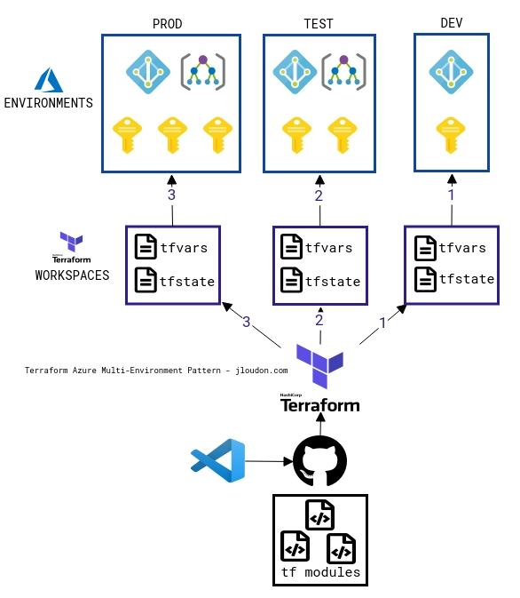
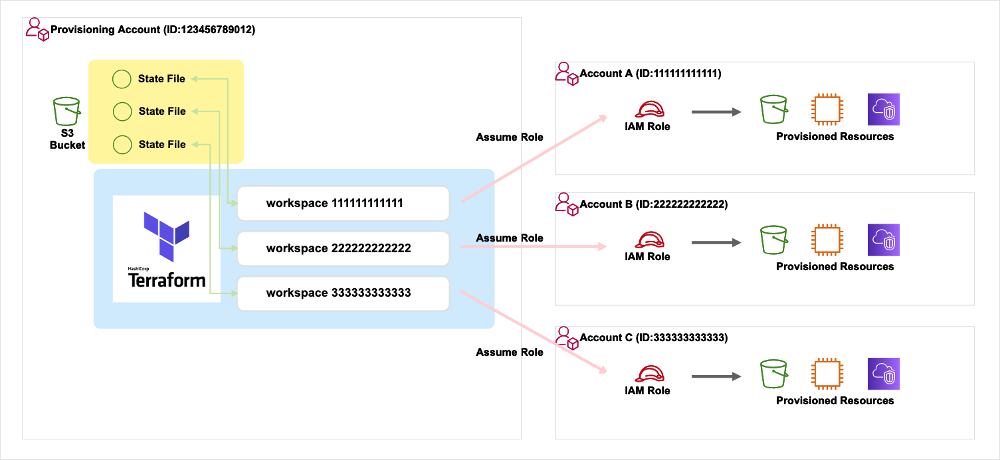
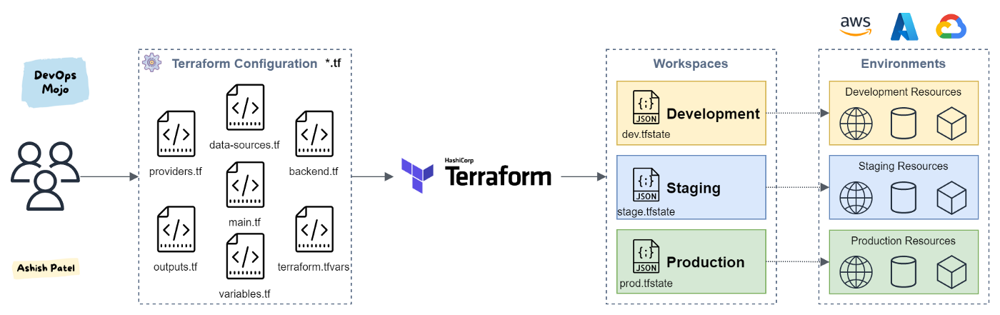
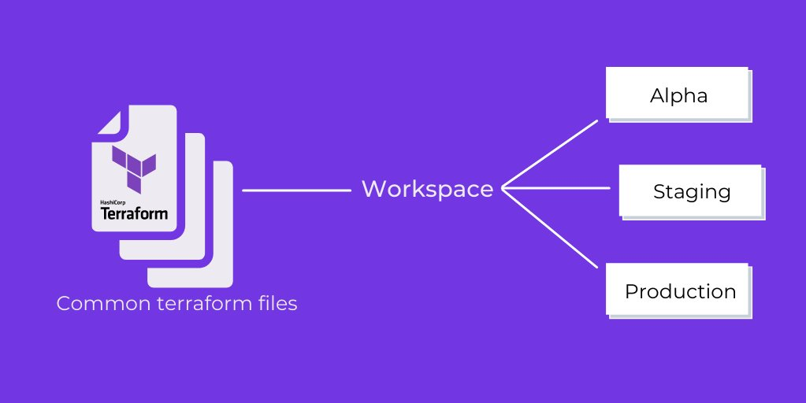
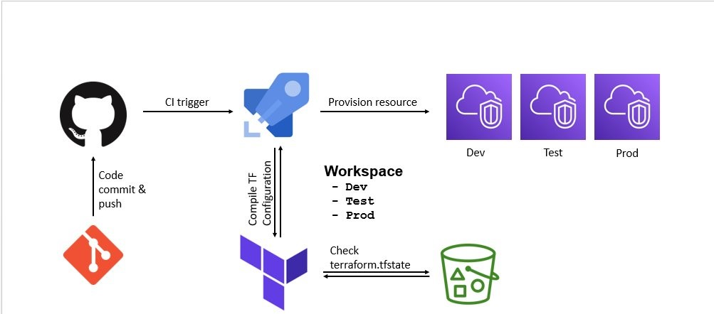

# Terraform Workspace

## What is the terraform workspace?

Workspaces in the Terraform CLI refer to separate instances of state data inside the same Terraform working directory. They are distinctly different from workspaces in Terraform Cloud, which each have their own Terraform configuration and function as separate working directories.

## Why not use terraform workspaces?

That is, if you use workspaces your live repo will have only one copy of the code, even though you may have 3 or 30 environments deployed with it. From merely looking at the code, there will be no way to know what is actually deployed, which will lead to mistakes and make maintenance complicated.

## What is the difference between terraform module and workspace?

Terraform Workspaces are intended to be a collection of configurations that represent a single environment, whereas Modules are components that can be utilized by one or more modules/configurations.

## What is the purpose of workspace?

Workspaces are meant to reduce clutter and make the desktop easier to navigate. Workspaces can be used to organize your work. For example, you could have all your communication windows, such as e-mail and your chat program, on one workspace, and the work you are doing on a different workspace.

## Why Terraform workspaces?

Workspaces allows you to separate your state and infrastructure without changing anything in your code when you wanted the same exact code base to deploy to multiple environments without overlap. i.e. Workspaces help to create multiple state files for set of same terraform configuration files.

[]
[]
[]
[]
[]
